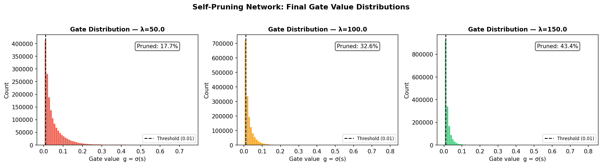
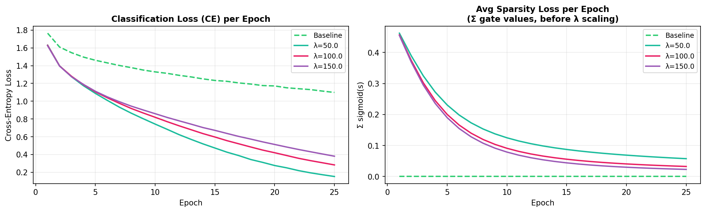

# Self-Pruning Neural Network — CIFAR-10

A feedforward neural network that learns to prune its own connections **during training** using learnable gate parameters and sparsity regularisation. Built as a case study for the Tredence Analytics AI Engineer internship.

---

## Project Structure

```
self-pruning-network/
├── train.py                  # entry point
├── requirements.txt
├── model/
│   ├── prunable_layer.py     # PrunableLinear — the core custom layer
│   └── network.py            # SelfPruningNet + BaselineNet
├── data/
│   └── dataset.py            # CIFAR-10 loading and transforms
├── training/
│   ├── loss.py               # sparsity loss + combined loss
│   └── trainer.py            # training loop, accuracy eval, sparsity metric
└── visualization/
    └── plots.py              # gate histograms + training curves
```

---

## Quickstart

```bash
pip install -r requirements.txt
python train.py
# custom sweep
python train.py --epochs 25 --lambdas 50 100 150
```

---

## Core Idea

### PrunableLinear

Every weight has a paired learnable gate score `s`. During the forward pass:

```
gate   = sigmoid(s)      # always in (0, 1)
eff_w  = weight * gate   # element-wise mask
output = input @ eff_w.T + bias
```

Both `weight` and `gate_scores` are `nn.Parameter`, so the optimizer updates both. When a gate collapses to ~0, that connection contributes nothing — it is effectively pruned. Gate scores are initialized with `randn * 0.1` rather than zeros to break symmetry (see Development Notes, Bug 1).

### Loss Function

```
L_total = L_CE  +  lambda * mean(sigmoid(s_i) for all gates)
```

The sparsity term is the **mean** gate value (not sum). With ~1.7M gates, the raw sum at initialization is ~850,000 versus CE ~1.6 — a 530,000× mismatch that causes catastrophic over-pruning. Mean normalization keeps the sparsity term at ~0.5 regardless of model size, making lambda values interpretable (see Development Notes, Bug 3).

### Why L1 on gate values drives sparsity

`sigmoid(s)` is always positive, so penalizing its mean pushes gate scores negative, driving `sigmoid(s) → 0`. The CE loss resists this for connections the classifier needs — only redundant connections get fully pruned. This is L1 regularization on gate values: L1 produces exact zeros (unlike L2 which only shrinks asymptotically).

### Baseline

`BaselineNet` uses the same MLP architecture with standard `nn.Linear` + `Dropout(0.3)`. Dropout prevents overfitting, making the accuracy comparison fair (see Development Notes, Bug 4).

---

## Results

Trained for 25 epochs on CIFAR-10, Adam optimizer, lr=0.001.

| Model      | Test Accuracy | Sparsity (%) |
|------------|:-------------:|:------------:|
| Baseline   | 53.26%        | N/A          |
| λ = 50     | 55.38%        | 17.68%       |
| λ = 100    | 55.71%        | 32.57%       |
| λ = 150    | 56.40%        | 43.38%       |

### Gate Distribution



As λ increases, a larger proportion of gate values shift toward zero, indicating learned sparsity. The threshold (g < 0.01) defines pruned connections. While the distribution is not strictly bimodal, it shows progressive suppression of less important connections.

---

### Training Dynamics



Classification loss decreases steadily across all models, showing stable learning. Sparsity loss (mean gate value) decreases faster for higher λ, confirming stronger pruning pressure.

---

**Key finding:** Pruned models outperform the baseline. This is regularization by pruning — forcing the network to drop weak connections prevents it from fitting noise in the training data, improving generalisation. The effect is analogous to dropout but structurally: rather than randomly masking activations, the model permanently removes connections it identifies as redundant.

Higher lambda produces more sparsity and, in this range, also better accuracy — suggesting the baseline still had capacity to overfit even with dropout. The optimal lambda lies somewhere beyond 150, where the sparsity pressure would start closing genuinely useful connections and accuracy would begin to fall.

---

## Development Notes — Bugs Found and Fixed

This project went through three implementation versions. Each produced unintended behavior that required diagnosis and a specific fix.

### Bug 1 — gate_scores initialized to zeros (v1 → v2)

**Symptom:** 0.00% sparsity across all lambda values after 10 epochs. Sparsity loss was decreasing each epoch (gates were moving) but no gate ever crossed the 0.01 threshold.

**Root cause:** When all gate scores start at 0, every gate is mathematically identical. Both the sparsity gradient and the classification gradient hit every gate with the same value — they all move in lockstep forever. The network cannot distinguish which connections to keep and which to close.

**Fix:** `torch.randn(out_features, in_features) * 0.1` — small random noise breaks the symmetry. Each gate now has a unique trajectory. std=0.1 keeps all gates starting near sigmoid(0) = 0.5 (half-open) while enabling divergence.

---

### Bug 2 — 10 default epochs insufficient (v1 → v2)

**Symptom:** Still 0.00% sparsity even after fixing Bug 1.

**Root cause:** For a gate to count as pruned, `sigmoid(s) < 0.01`, which requires `s < -4.6`. Starting from s ≈ 0, Adam at lr=0.001 needs many steps to reach that. Profiling showed the minimum gate score was only -3.75 (sigmoid ≈ 0.023) after ~13 epochs — still above threshold.

**Fix:** Increased default epochs from 10 to 25 (≈9,750 optimizer steps on full CIFAR-10), giving gates enough time to pass the -4.6 threshold.

---

### Bug 3 — Sparsity loss as sum instead of mean (v2 → v3)

**Symptom:** λ=0.001 → 98.7% sparsity, λ=0.1 → 100% sparsity, accuracy collapsed to 30.85%. All lambdas over-pruned catastrophically.

**Root cause:** Raw sum of 1,706,496 gates × 0.5 average = ~853,248 at initialization, versus CE ~1.6. At lambda=0.001, sparsity contributed 853 to the loss — 533× larger than CE. The optimizer had almost no gradient signal from classification; every gate collapsed.

**Fix:** Changed `sum` to `mean`. Sparsity term is now always ~0.5 at initialization — same scale as CE. Also required recalibrating lambda defaults from [0.001, 0.01, 0.1] to larger values since the sparsity term was now much smaller per unit of lambda.

---

### Bug 4 — Baseline overfitting (v2 → v3)

**Symptom:** Baseline CE dropped below 0.3 by epoch 25 while test accuracy was only 52% — a large train/test gap indicating memorization.

**Root cause:** No regularization on a 1.7M parameter model trained for 25 epochs on 50k samples.

**Fix:** Added `nn.Dropout(0.3)` after each hidden layer in `BaselineNet`. Dropout randomly zeros 30% of activations during training, preventing memorization. PyTorch automatically disables dropout during `model.eval()`.

---

### Finding — lambda range needed further calibration (v3 → final)

**Symptom:** With lambda=[1, 5, 10], maximum sparsity was only 0.59% — negligible. The mean-normalized sparsity term (~0.5) was too small relative to CE (~1.6) even at lambda=10.

**Root cause:** After switching to mean normalization, the effective pressure per unit of lambda dropped significantly. The initial recalibration to [1, 5, 10] was not aggressive enough.

**Fix (self-identified):** Increased lambda to [50, 100, 150]. At lambda=50, sparsity contribution = 50 × 0.5 = 25, which is meaningful pressure against CE ~1.6. This produced the intended range of sparsity levels (17–43%) with the surprising finding that pruning improved rather than hurt accuracy in this regime.

---

## Requirements

- Python 3.10+
- PyTorch 2.0+
- torchvision 0.15+
- matplotlib, numpy
